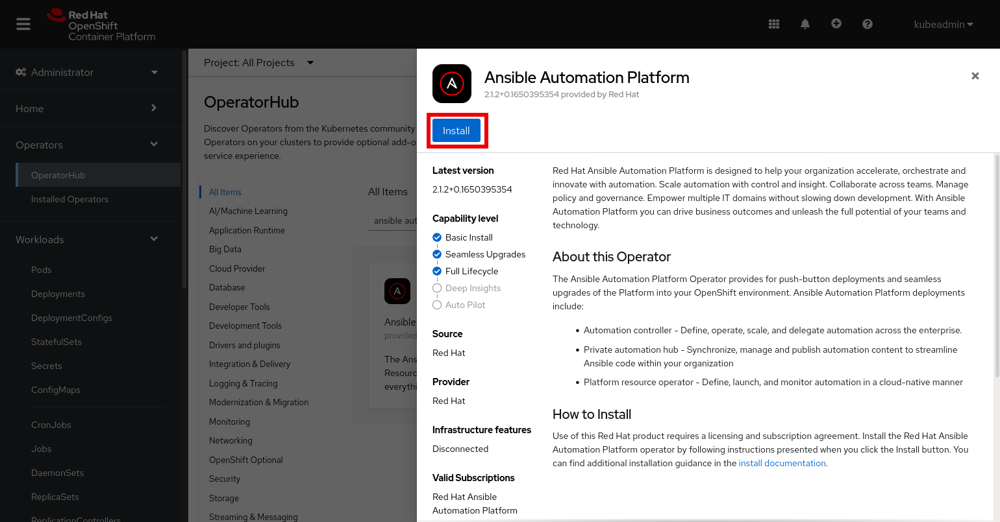

:doctype: book

= Integrate Private Automation Hub with Red Hat Single Sign-On on OpenShift Container Platform

<<<
toc::[]

<<<

== Introduction

[IMPORTANT]
====
As of Aug. 4, 2022 official documentation has been released.
See https://access.redhat.com/documentation/en-us/red_hat_ansible_automation_platform/2.2/html/red_hat_ansible_automation_platform_operator_installation_guide/using-rhsso-operator-with-automation-hub[Using Red Hat Single Sign-On Operator with automation hub]
====

The Ansible Automation Platform (AAP) Private Automation Hub (PAH) component utilizes Red Hat Single Sign-On (RH-SSO) for external authentication.
When installing AAP on VMs the installer is able to automatically install and configure RH-SSO for use with PAH.
RH-SSO integration has not been implemented when installing AAP on OpenShift (OCP) using the AAP Operator.
This document outlines the process to configure RH-SSO and integrate it with PAH when AAP is installed on OCP.

== Install the RH-SSO Operator

. Navigate to the menu:Operators[Operator Hub]
+

. Search for the Red Hat Single Sign-On Operator and click on the Operator tile
+

. Click btn:[Install]
+

. Select a Project to install the Operator into
+

+
[NOTE]
====
If the installation should occur in a new project select *Create Project* from the drop-down and then enter the project name in the popup dialog box and click btn:[Create].

====

. Click btn:[Install]
+

. Wait for Operator install to complete

. Once the Operator has installed click btn:[View Operator]
+

== Create Keycloak instance and Master Realm

. If not already on the Red Hat Single Sign-On Operator Details page

.. Navigate to menu:Operators[Installed Operators]
+

.. Select the RH-SSO project
+
image::images/rh-sso/select_project.png[]

.. Click on Red Hat Single Sign-On Operator
+

. On the RH-SSO Operator *Details* page click btn:[Create Instance] on the *Keycloak* tile
+
image::images/rh-sso/keycloak_instance.png[]

. Click btn:[YAML view]
+

. The YAML should be look like:
+
[source,yaml]
----
apiVersion: keycloak.org/v1alpha1
kind: Keycloak
metadata:
  name: example-keycloak
  labels:
    app: sso
  namespace: rh-sso
spec:
  externalAccess:
    enabled: true
  instances: 1
----
+
[NOTE]
====
This example uses the defaults.
There are other options that may need to be set.
====

. Click btn:[Create]
+

. Wait for Keycloak Instance creation to complete
+

+
[NOTE]
====
The credentials for the Master realm will be stored in a Secret called `credential-example-keycloak`.
This credential can be used to login to the admin console.
Making changes in the admin console will not update the Custom Resource.
It is recommended that changes be made by updating the Custom Resource.
====

== Create Keycloak realm for AAP

. If not already on the Red Hat Single Sign-On Operator Details page

.. Navigate to menu:Operators[Installed Operators]
+

.. Select the RH-SSO project
+
image::images/rh-sso/select_project.png[]

.. Click on Red Hat Single Sign-On Operator
+

. Click on *KeycloakRealm*
+

. Click btn:[Create KeycloakRealm]
+
image::images/rh-sso/keycloak_realm_create_button.png[]

. If not already selected click btn:[YAML view]
+

. Modify the YAML as shown below
+
[source,yaml]
----
kind: KeycloakRealm
apiVersion: keycloak.org/v1alpha1
metadata:
  name: ansible-automation-platform-keycloakrealm   # <1>
  namespace: rh-sso
  labels:
    app: sso                                        # <2>
    realm: ansible-automation-platform              # <2>
spec:
  realm:
    id: ansible-automation-platform                 # <3>
    realm: ansible-automation-platform              # <3>
    enabled: true
    displayName: Ansible Automation Platform        # <4>
  instanceSelector:
    matchLabels:
      app: sso
----
<1> Set a unique value for the name of the configuration resource (CR)
<2> Set to a unique value. This will be used when creating the client CR
<3> Set the realm name and id. For ease these should be the same
<4> Set the name to display

. Click btn:[Create] to create the realm
+

. Wait for the realm creation to complete
+

== Create client for Automation Hub

. If not already on the Red Hat Single Sign-On Operator Details page

.. Navigate to menu:Operators[Installed Operators]
+

.. Select the RH-SSO project
+
image::images/rh-sso/select_project.png[]

.. Click on Red Hat Single Sign-On Operator
+

. Click on *KeycloakClient*
+

. Click btn:[Create KeycloakClient]
+

. If not already selected click btn[YAML view]
+

[#keycloakclient-yaml]
. Replace the default YAML with the YAML below
+
[source,yaml]
----
kind: KeycloakClient
apiVersion: keycloak.org/v1alpha1
metadata:
  name: automation-hub-client-secret
  labels:
    app: sso
    realm: ansible-automation-platform
  namespace: rh-sso
spec:
  realmSelector:
    matchLabels:
      app: sso
      realm: ansible-automation-platform
  client:
    name: Automation Hub
    clientId: automation-hub
    secret: client-secret                       # <1>
    clientAuthenticatorType: client-secret
    description: Client for Automation Hub
    attributes:
      user.info.response.signature.alg: RS256
      request.object.signature.alg: RS256
    directAccessGrantsEnabled: true
    publicClient: true
    protocol: openid-connect
    standardFlowEnabled: true
    protocolMappers:
      - config:
          access.token.claim: "true"
          claim.name: "family_name"
          id.token.claim: "true"
          jsonType.label: String
          user.attribute: lastName
          userinfo.token.claim: "true"
        consentRequired: false
        name: family name
        protocol: openid-connect
        protocolMapper: oidc-usermodel-property-mapper
      - config:
          userinfo.token.claim: "true"
          user.attribute: email
          id.token.claim: "true"
          access.token.claim: "true"
          claim.name: email
          jsonType.label: String
        name: email
        protocol: openid-connect
        protocolMapper: oidc-usermodel-property-mapper
        consentRequired: false
      - config:
          multivalued: "true"
          access.token.claim: "true"
          claim.name: "resource_access.${client_id}.roles"
          jsonType.label: String
        name: client roles
        protocol: openid-connect
        protocolMapper: oidc-usermodel-client-role-mapper
        consentRequired: false
      - config:
          userinfo.token.claim: "true"
          user.attribute: firstName
          id.token.claim: "true"
          access.token.claim: "true"
          claim.name: given_name
          jsonType.label: String
        name: given name
        protocol: openid-connect
        protocolMapper: oidc-usermodel-property-mapper
        consentRequired: false
      - config:
          id.token.claim: "true"
          access.token.claim: "true"
          userinfo.token.claim: "true"
        name: full name
        protocol: openid-connect
        protocolMapper: oidc-full-name-mapper
        consentRequired: false
      - config:
          userinfo.token.claim: "true"
          user.attribute: username
          id.token.claim: "true"
          access.token.claim: "true"
          claim.name: preferred_username
          jsonType.label: String
        name: username
        protocol: openid-connect
        protocolMapper: oidc-usermodel-property-mapper
        consentRequired: false
      - config:
          access.token.claim: "true"
          claim.name: "group"
          full.path: "true"
          id.token.claim: "true"
          userinfo.token.claim: "true"
        consentRequired: false
        name: group
        protocol: openid-connect
        protocolMapper: oidc-group-membership-mapper
      - config:
          multivalued: 'true'
          id.token.claim: 'true'
          access.token.claim: 'true'
          userinfo.token.claim: 'true'
          usermodel.clientRoleMapping.clientId:  'automation-hub'
          claim.name: client_roles
          jsonType.label: String
        name: client_roles
        protocolMapper: oidc-usermodel-client-role-mapper
        protocol: openid-connect
      - config:
          id.token.claim: "true"
          access.token.claim: "true"
          included.client.audience: 'automation-hub'
        protocol: openid-connect
        name: audience mapper
        protocolMapper: oidc-audience-mapper
  roles:
    - name: "hubadmin"
      description: "An administrator role for Automation Hub"
----
<1> Set to a unique value

. Click btn:[Create] to create the client
+

. Wait for the realm creation to complete
+

== Create a User

In this step a user will be created that can be used to login to the Automation Hub.
The user will have Super Admin privileges when logged in due to the hubadmin role being assigned.

. If not already on the Red Hat Single Sign-On Operator Details page

.. Navigate to menu:Operators[Installed Operators]
+

.. Select the RH-SSO project
+
image::images/rh-sso/select_project.png[]

.. Click on Red Hat Single Sign-On Operator
+

. Click on *KeycloakUser*
+

. Click btn:[Create KeycloakUser]
+
image::images/rh-sso/keycloak_user_create.png[]

. If not already selected click btn[YAML view]
+

. Replace the default YAML with the YAML below
+
[source,yaml]
----
apiVersion: keycloak.org/v1alpha1
kind: KeycloakUser
metadata:
  name: hubadmin-user
  labels:
    app: sso
    realm: ansible-automation-platform
  namespace: rh-sso
spec:
  realmSelector:
    matchLabels:
      app: sso
      realm: ansible-automation-platform
  user:
    username: hub_admin
    firstName: Hub
    lastName: Admin
    email: hub_admin@example.com
    enabled: true
    emailVerified: false
    credentials:
      - type: password
        value: ch8ngeme
    clientRoles:
      automation-hub:
        - hubadmin
----
+
[IMPORTANT]
====
After a user is created, the Operator creates a Secret containing the both username and password using the following naming pattern: credential-<realm name>-<username>-<namespace>.
In this example the credential will be called `credential-ansible-automation-platform-hub-admin-rh-sso`.
Once a user is created the operator will not update the users password and password changes will not be reflected in the secret.
====

. Click btn:[Create]
+

== Install Ansible Automation Platform Operator

. Follow the https://access.redhat.com/documentation/en-us/red_hat_ansible_automation_platform/2.1/html/red_hat_ansible_automation_platform_operator_installation_guide/installing-hub-operator[installation instructions] on the documentation website.

. Navigate to the menu:Operators[Operator Hub]
+

. Search for the Ansible Automation Platform Operator and click on the Operator tile
+

. Click btn:[Install]
+

. Select a Namespace (Project) to install the Operator into.
It is recommended to use the `Operator recommended Namespace` name.
+

+
[NOTE]
====
If the installation should occur in a namespace other than the recommended one, click btn:[Select a Namespace].
Then select an existing project or to create a new project select *Create Project* from the drop-down and then enter the project name in the popup dialog box and click btn:[Create].

====

. Click btn:[Install]
+

. Wait for Operator install to complete

. Once the Operator has installed click btn:[View Operator]
+

== Create a Secret to hold the RH-SSO connection details

. [[sso_public_key]]Retreive the RH-SSO Public Key for the AAP realm
.. Browse to https://<sso_host>/auth/realms/ansible-automation-platform
+

.. Copy/Save the `public_key` value for use below

. Create Secret to hold the SSO details
.. In the OpenShift Web UI browse to menu:Workloads[Secrets]
+

.. Select menu:Project[ansible-automation-platform]
+

.. Click menu:Create[From YAML]
+
image::images/aap/ocp_secret_create_yaml.png[]

.. Use the YAML below to create the secret
+
[[hub_sso_secret]]
[source,yaml]
----
apiVersion: v1
kind: Secret
metadata:
  name: automation-hub-sso                       # <1>
  namespace: ansible-automation-platform
type: Opaque
stringData:
  keycloak_host: "keycloak-rh-sso.apps-crc.testing"
  keycloak_port: "443"
  keycloak_protocol: "https"
  keycloak_realm: "ansible-automation-platform"
  keycloak_admin_role: "hubadmin"
  social_auth_keycloak_key: "automation-hub"
  social_auth_keycloak_secret: "client-secret"   # <2>
  social_auth_keycloak_public_key: >-            # <3>
    MIIBIjANBgkqhkiG9w0BAQEFAAOCAQ8AMIIBCgKCAQEAi9+C4v9fHF3XD14JRxXrGXF8tHNv7XlNyDMbsiPe8ROcjGCHSu6pEd2r48fgD58FrUx8cKDo9ff38h26Ytsv0y+DB0QmYOhjEqUQezLf9V5pft4xhnH24XeS8DmSoIdHfBOoY0/cNwBaUXOpmFk93E8NaLfqCgWUR7HRWPAJvWCrqFykjgSD/Z8MK2hxLAkvTKFx0oI30mbtBuuzahB4lqjenz/hQNmTNQSa0WBHrq9vm1uYuaAUR6B8ytbQ3NfFzaKiUu5AGZl8b9WUqJBYXXkfVQn51nLF7ccCwVsOGNwzyf5w1Su07INHFJAwJY/9ma+9asJq5B1j7glncLY6hwIDAQAB
----
<1> This name will be used in the next step when creating the Automation Hub instance
<2> If the secret was changed when creating the <<keycloakclient-yaml, Keycloak client>> for Automation Hub be sure to change this value to match
<3> The value is the `public_key` found in the <<sso_public_key, previous>> step

.. Click btn:[Create]
+

== Install Automation Hub via the Operator

. Navigate to menu:Operators[Installed Operators]
+

. Click on the Ansible Automation Platform
+
image::images/aap/aap_operator.png[]

. Select Automation Hub
+

. Click btn:[Create AutomationHub]
+

. Click btn:[YAML view]
+

. The YAML should be look like:
+
[source,yaml]
----
apiVersion: automationhub.ansible.com/v1beta1
kind: AutomationHub
metadata:
  name: private-ah                              # <1>
  namespace: ansible-automation-platform
spec:
  sso_secret: automation-hub-sso                # <2>
  pulp_settings:
    verify_ssl: false
  route_tls_termination_mechanism: Edge
  ingress_type: Route
  loadbalancer_port: 80
  file_storage_size: 100Gi
  image_pull_policy: IfNotPresent
  web:
    replicas: 1
  file_storage_access_mode: ReadWriteMany
  content:
    log_level: INFO
    replicas: 2
  postgres_storage_requirements:
    limits:
      storage: 50Gi
    requests:
      storage: 8Gi
  api:
    log_level: INFO
    replicas: 1
  postgres_resource_requirements:
    limits:
      cpu: 1000m
      memory: 8Gi
    requests:
      cpu: 500m
      memory: 2Gi
  loadbalancer_protocol: http
  resource_manager:
    replicas: 1
  worker:
    replicas: 2
----
<1> Set this to the name to use for the instance
<2> Set this to the name of the <<hub_sso_secret, secret>> previously created
+
[WARNING]
====
The above YAML turns off SSL verification (`ssl_verify: false`).
If not using self-signed certificates for OpenShift this setting can be removed.
====

. Click btn:[Create]
+

. Wait for the instance creation to complete
+

[#hub_route]
== Determine Automation Hub Route

. Navigate to menu:Networking[Routes]
. Select the project used for the install (default project is ansible-automation-platform)
. Note/copy the Location for the private-ah-web-svc Service.
+
[NOTE]
====
The name of the service (private-ah-web-svc) will be different if you used a different name when creating the Automation Hub instance.
====
+
This will be used later to update the RH-SSO client.
+

== Update the RH-SSO client

Now that Automation Hub has been installed and we know the URL to for the instance the RH-SSO client needs to be updated to set the Valid Redirect URIs and Web Origins settings.

. Navigate to menu:Operators[Installed Operators]
+

. Select the RH-SSO project
+
image::images/rh-sso/select_project.png[]

. Click on Red Hat Single Sign-On Operator
+

. Select KeycloakClient
+

. Click on the automation-hub-client-secret client
+

. Select YAML
+

. Update the Client YAML to add the Valid Redirect URIs and Web Origins settings.
+
[source,yaml]
----
    redirectUris:
      - 'https://private-ah-ansible-automation-platform.apps-crc.testing/*'   #<1>
    webOrigins:
      - 'https://private-ah-ansible-automation-platform.apps-crc.testing'     #<1>
----
<1> This is the location determined in the <<hub_route>> section.
Be sure to add the `/*` to the end of the `redirectUris` setting.
+
[IMPORTANT]
====
Ensure the indentation is correct when entering these settings.
====
+

. Click btn:[Save]
+

== Verify Connectivy and Redirection

. Browse to the Automation Hub route. The browser should automatically redirect to the RH-SSO login page
+

. Enter the `hub_admin` user credentials and click btn:[Sign in]
+

. RH-SSO will process the authentication and redirect back to Automation Hub as the now logged in user.
+

